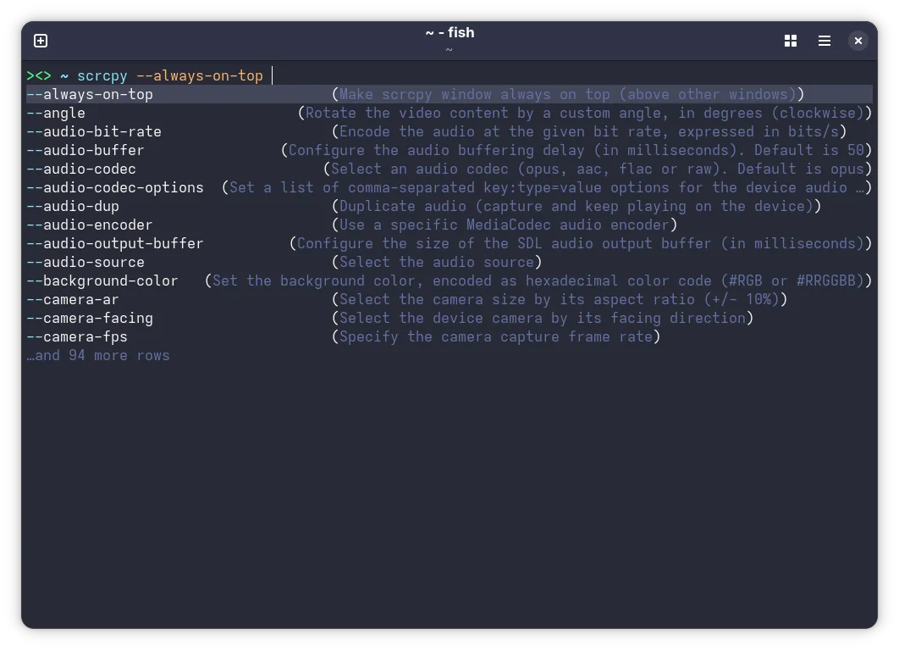
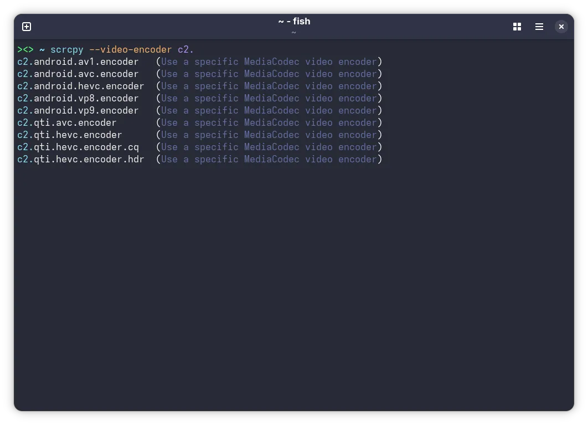
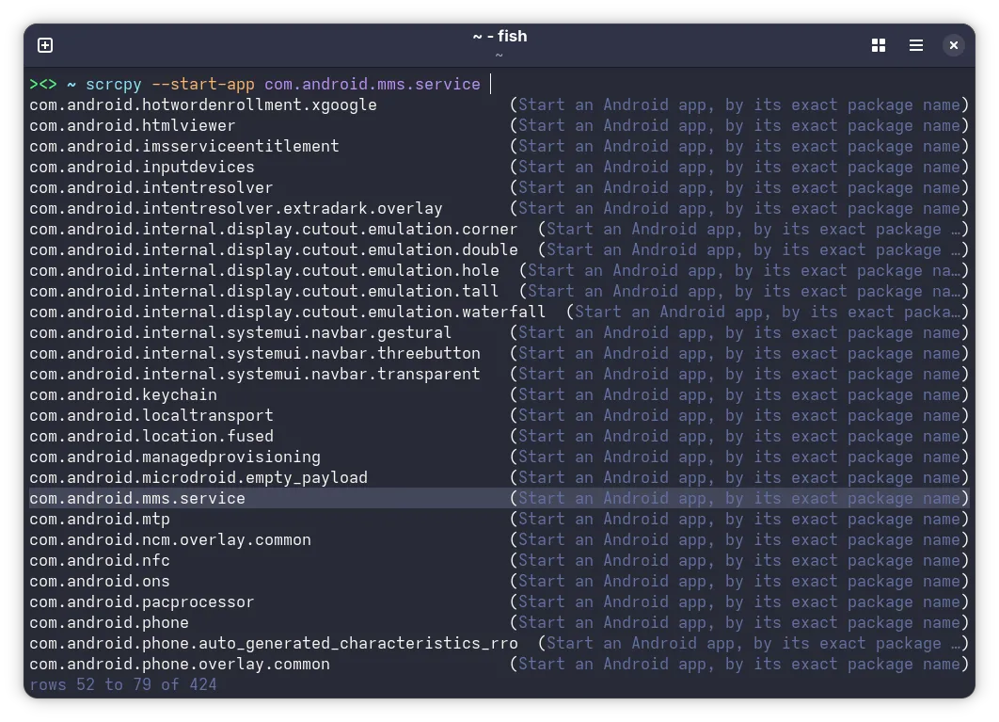

# scrcpy fish completions
Fish completions for scrcpy.

## Screenshots





## Installation

```sh
curl https://raw.githubusercontent.com/unaaagy/scrcpy-fish-completions/refs/heads/main/scrcpy.fish --create-dirs -o ~/.config/fish/completions/scrcpy.fish
```
